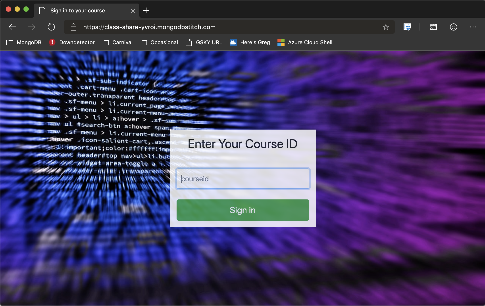
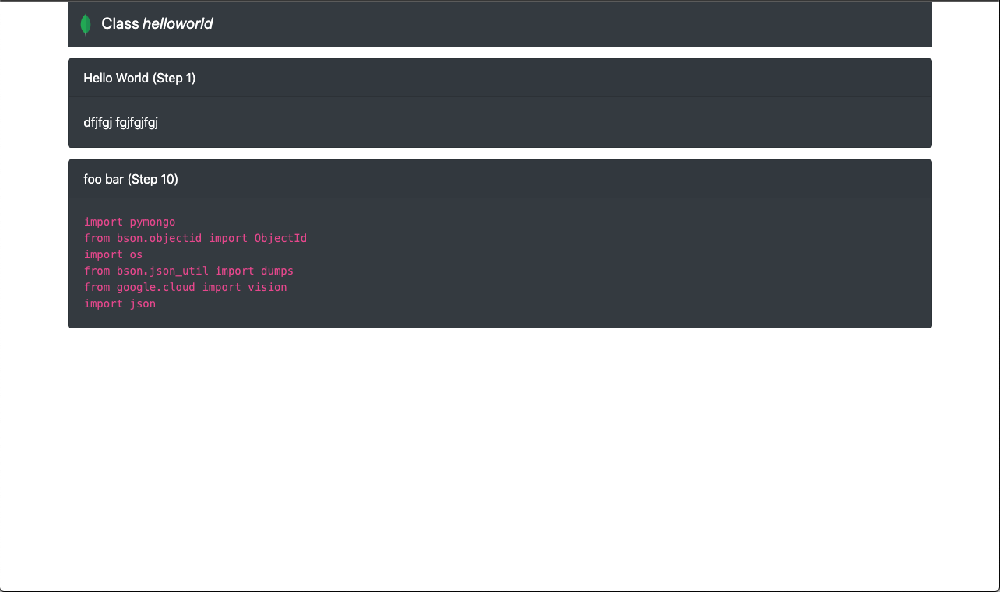
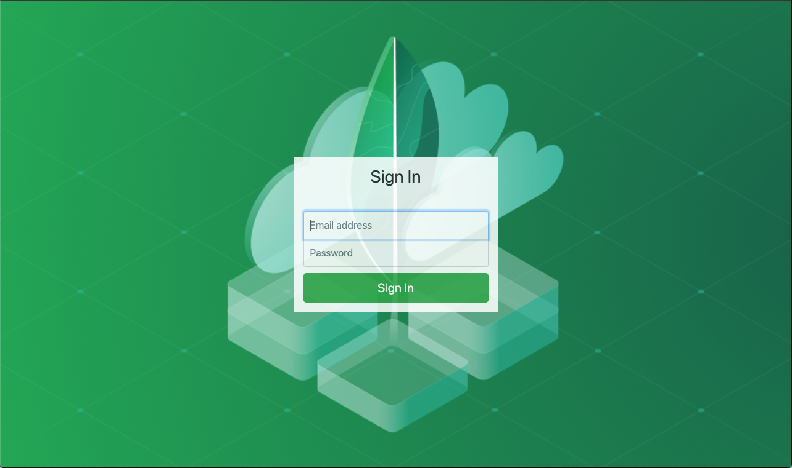
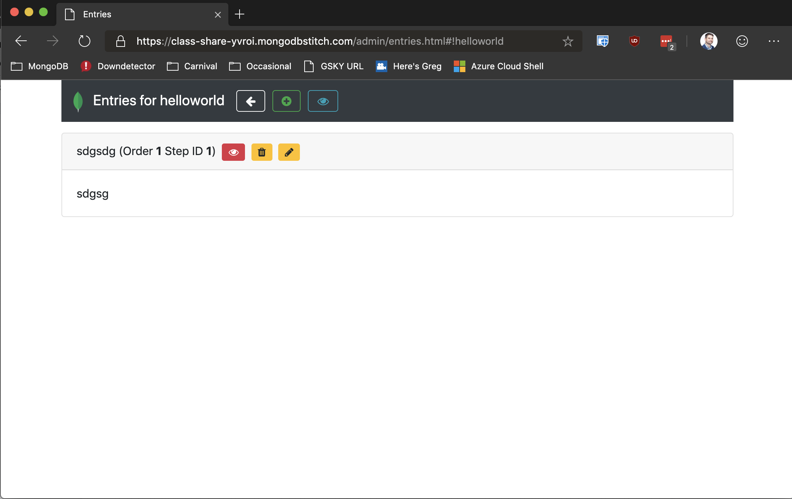

# class-share

A simple application to share code snippets and messages to a classroom

# Deployment
 * Create a MongoDB Atlas cluster (free tier will work)
 * Create a database called `classshare` with collection `shareable`
 * Create a Stitch app tying to the atlas cluster with default settings (keep the Stitch Service Name for the clister named `mongodb-atlas`)
 * Enable Stitch Hosting
 * Edit [Stitch-Hosting/conf/conf.js](Stitch-Hosting/conf/conf.js) to change the ID of the Stitch app to what was created above (can copy/paste from the top left of the Stitch portal)
 * Upload all files to Stitch Hosting
 * Enable anonymous authentication
 * Enable Email authentication and create a user (note that user registration is not completed yet so you must manually create the user in the Stitch portal)
 * Set up a Stitch rule as follows"
   * For the database called `classshare` with collection `shareable`
   * Create a rule called `admin` that can insert, delete, read, write with the rule `{  "owner.id": "%%user.id" }` to allow authenticated users to do all CRUD operations on thier class materials
   * Create a second rule called default that can only read with the rule `{  "visible": true }` so anonymous users can read class materials if they are visible
 * Visit your stitch app by going to the URI specified in the hosting page and you are good to go

# Screenshots

## Rules Configuration

## User Experience

## Admin / Instructor Expereince

