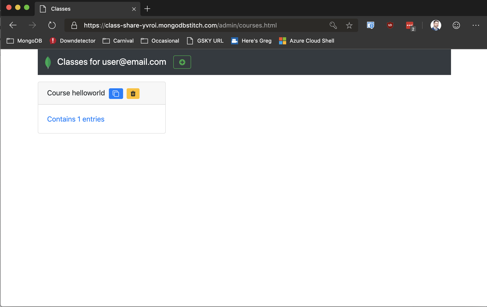

# class-share

A simple application to share code snippets and messages to a classroom built on top of MongoDB Atlas and MongoDB Stitch serverless platform

# Deployment
 * Create a MongoDB Atlas cluster (free tier will work)
 * Create a database called `classshare` with collection `classes`
 * Create a Stitch app tying to the atlas cluster with default settings (keep the Stitch Service Name for the clister named `mongodb-atlas`)
 * Enable Stitch Hosting
 * Edit [Stitch-Hosting/conf/conf.js](Stitch-Hosting/conf/conf.js) to change the ID of the Stitch app to what was created above (can copy/paste from the top left of the Stitch portal)
 * Upload all files to Stitch Hosting
 * Enable anonymous authentication
 * Enable Email authentication and create a user (note that user registration is not completed yet so you must manually create the user in the Stitch portal)
 * Set up a Stitch rule as follows"
   * For the database called `classshare` with collection `classes`
   * Create a rule called `admin` that can insert, delete, read, write with the rule `{  "owner.id": "%%user.id" }` to allow authenticated users to do all CRUD operations on thier class materials
   * Create a second rule called default that can only read 
 * Visit your stitch app by going to the URI specified in the hosting page and you are good to go

# Document Schema
## Notes
* Unique index on `classid` string
* `entries` is an array of each individual thing that can be sent to the class
* each of the objects in the `entries` array has an `entryid` which should be unique and represents the sorting order and is an int32
* `title` is optional string and if provided will be the title in the bootstrap card
* `visible` is boolean and describes if it should be displayed yet to the students
* `value` is the string content that should be displayed in the bootstrap card
* `type` is a string enum of `text` (display as is), `code` (will wrap in a preformatted code block), or `markdown` (markdown code) to describe any formatting to be used on the `value` content when rendering it
* If `type` is `token` it will instead take each line of the `value` main content text box and treat it as a single use coupon code token for distribution to a class. In its place in the content area will be a button to generate the token, tokens are recorded when they are used.

## Sample Schema
```
{
        "_id" : ObjectId("5d6bba4ece5bd32cccaf5d96"),
        "classid" : "testcourse",
        "entries" : [
                {
                        "entryid" : 1,
                        "title" : "testing",
                        "visible" : false,
                        "type" : "text",
                        "value" : "hello"
                },
                {
                        "entryid" : 6,
                        "title" : "test2",
                        "visible" : false,
                        "type" : "code",
                        "value" : "world"
                }
        ],
        "owner" : {
                "id" : "ffcc73ffffffe09ddcd56b00",
                "email" : "user@domain.com"
        }
}
```

# Screenshots

## Rules Configuration


## User Experience


## Admin / Instructor Expereince





